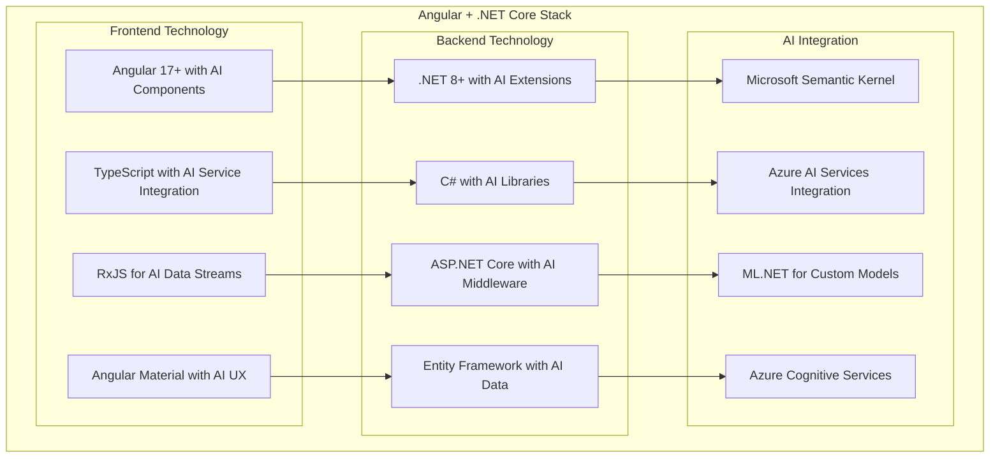
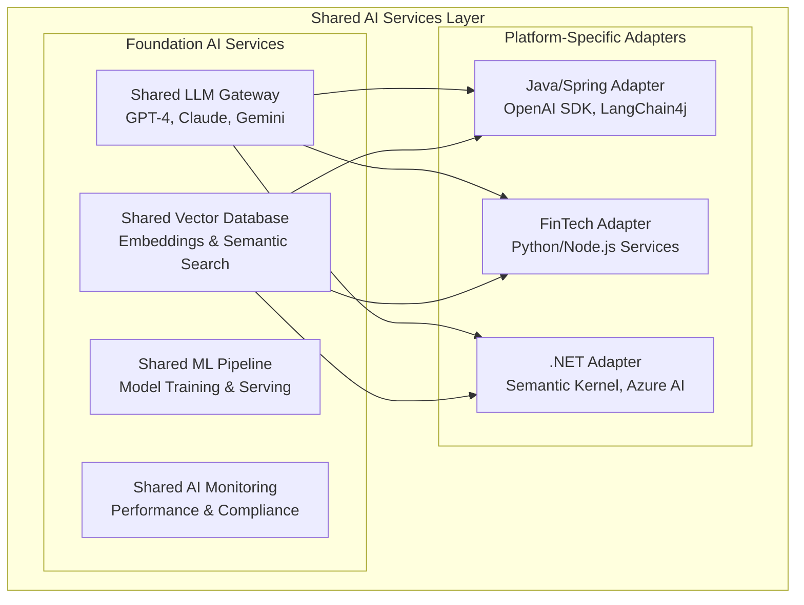
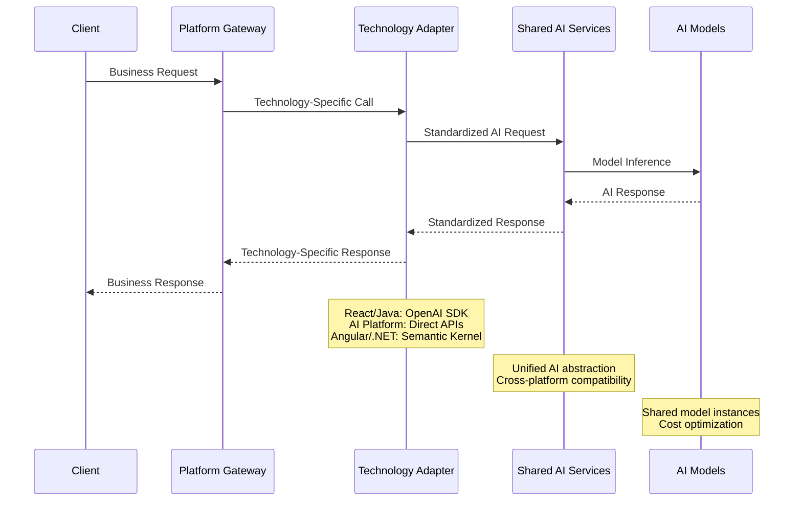
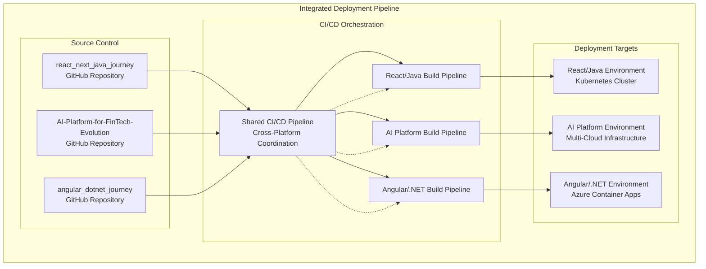
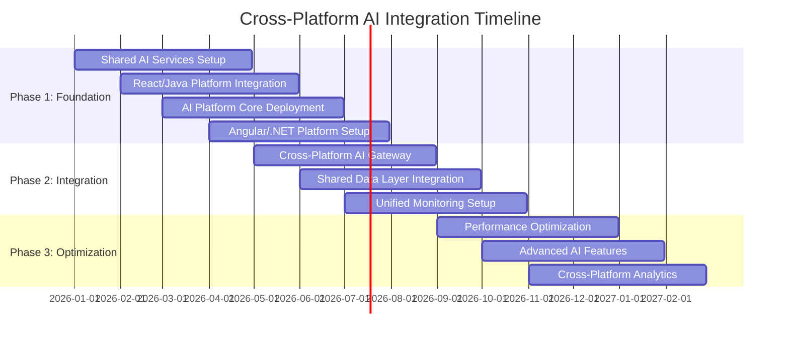

# Cross-Repository AI Platform Integration Guide
## Unified Architecture Across React/Java, AI Platform, and Angular/.NET Stacks

---

## 🌐 Integration Overview

This document explains how the **Enhanced Enterprise AI Architecture** seamlessly integrates across three technology stacks:

1. **react_next_java_journey**: Full-stack React/Next.js + Java Spring Boot platform
2. **AI-Platform-for-FinTech-Evolution**: AI-native financial technology platform  
3. **angular_dotnet_journey**: Enterprise Angular + .NET Core platform

Each repository implements the same enhanced 13-layer architecture but with technology-specific adaptations and domain-focused AI capabilities.

---

## 🏗️ Unified Architecture Framework

### **Common 13-Layer Architecture Across All Platforms**

```mermaid
graph TB
    subgraph "Universal 13-Layer AI Architecture"
        subgraph "Client & Security (Layers 1-4)"
            L1[Layer 1: Security - Zero Trust AI]
            L2[Layer 2: Monitoring - AI Observability]  
            L3[Layer 3: DevOps - AI-Enhanced CI/CD]
            L4[Layer 4: Frontend - Intelligent UX]
        end
        
        subgraph "AI Intelligence Hub (Layers 5-8)"
            L5[Layer 5: API Gateway - Intelligent Routing]
            L6[Layer 6: MCP Gateway - AI Tool Orchestration]
            L7[Layer 7: MCP Framework - Multi-Agent Coordination]
            L8[Layer 8: AI Platform - Strategic Intelligence Engine]
        end
        
        subgraph "Business Logic (Layers 9-11)"
            L9[Layer 9: Microservices - Domain Intelligence]
            L10[Layer 10: Message Queue - Event Intelligence]
            L11[Layer 11: Event Streaming - Real-time Analytics]
        end
        
        subgraph "Data & Infrastructure (Layers 12-13)"
            L12[Layer 12: Data Platform - AI Data Mesh]
            L13[Layer 13: Infrastructure - Multi-Cloud AI]
        end
    end
    
    L1 --> L2 --> L3 --> L4
    L4 --> L5 --> L6 --> L7 --> L8
    L8 --> L9 --> L10 --> L11
    L11 --> L12 --> L13
```



---

## 🔗 Repository-Specific Implementations

### **1. react_next_java_journey - Full-Stack Enterprise Platform**

```mermaid
graph TB
    subgraph "React/Next.js + Java Spring Boot Stack"
        subgraph "Frontend Technology"
            REACT[React 18+ with AI Components]
            NEXTJS[Next.js 14+ with AI SSR/SSG]
            TYPESCRIPT[TypeScript with AI Type Safety]
            TAILWIND[Tailwind CSS with AI-driven Design]
        end
        
        subgraph "Backend Technology"
            SPRING[Spring Boot 3+ with AI Services]
            JAVA[Java 21+ with AI Libraries]
            SPRING_AI[Spring AI Framework]
            MAVEN[Maven with AI Dependencies]
        end
        
        subgraph "AI Integration"
            OPENAI_JAVA[OpenAI Java SDK]
            LANGCHAIN_JAVA[LangChain4j Integration]
            VECTOR_DB[Vector Database (Pinecone/Weaviate)]
            ML_MODELS[Custom ML Models (TensorFlow/PyTorch)]
        end
    end
    
    REACT --> SPRING
    NEXTJS --> JAVA
    TYPESCRIPT --> SPRING_AI
    TAILWIND --> MAVEN
    
    SPRING --> OPENAI_JAVA
    JAVA --> LANGCHAIN_JAVA
    SPRING_AI --> VECTOR_DB
    MAVEN --> ML_MODELS
```

**Key Implementation Features:**
- **Frontend**: React-based intelligent dashboards with AI-powered components
- **Backend**: Java Spring Boot microservices with embedded AI capabilities
- **AI Layer**: OpenAI API integration with custom ML model serving
- **Data**: PostgreSQL with vector extensions for AI data storage
- **Deployment**: Docker containers with Kubernetes orchestration

### **2. AI-Platform-for-FinTech-Evolution - AI-Native Financial Platform**

```mermaid
graph TB
    subgraph "FinTech AI-Native Platform"
        subgraph "Financial AI Services"
            FRAUD_AI[Real-time Fraud Detection]
            RISK_AI[Predictive Risk Analytics]
            COMPLIANCE_AI[Regulatory Compliance Automation]
            TRADING_AI[Algorithmic Trading Intelligence]
        end
        
        subgraph "Multi-Model AI Orchestra"
            FOUNDATION_MODELS[Foundation Models (GPT-4, Claude)]
            FINANCIAL_MODELS[Custom FinTech Models]
            VISION_AI[Document Processing AI]
            TIME_SERIES[Financial Time Series Models]
        end
        
        subgraph "Financial Data Intelligence"
            MARKET_DATA[Real-time Market Data Streams]
            TRANSACTION_DATA[Transaction Analytics Pipeline]
            CUSTOMER_DATA[Customer Behavior Analytics]
            REGULATORY_DATA[Compliance Data Management]
        end
    end
    
    FRAUD_AI --> FOUNDATION_MODELS --> MARKET_DATA
    RISK_AI --> FINANCIAL_MODELS --> TRANSACTION_DATA
    COMPLIANCE_AI --> VISION_AI --> CUSTOMER_DATA
    TRADING_AI --> TIME_SERIES --> REGULATORY_DATA
```

**Key Implementation Features:**
- **AI-First Architecture**: Every service enhanced with domain-specific AI
- **Financial Models**: Custom-trained models for FinTech use cases
- **Real-time Processing**: Stream processing for financial data analysis
- **Compliance Engine**: Automated regulatory compliance with AI validation
- **Multi-Cloud**: Azure/AWS/GCP for vendor independence and redundancy

### **3. angular_dotnet_journey - Enterprise Angular + .NET Platform**



**Key Implementation Features:**
- **Frontend**: Angular with intelligent components and AI-driven user experiences
- **Backend**: .NET Core with Microsoft AI ecosystem integration
- **AI Layer**: Semantic Kernel for AI orchestration and Azure AI Services
- **Data**: SQL Server with AI-enhanced analytics and Azure integration
- **Cloud**: Azure-native deployment with AI service integration

---

## 🔄 Cross-Platform AI Integration Patterns

### **Common AI Integration Patterns Across All Platforms**

| **Layer** | **React/Java** | **AI Platform** | **Angular/.NET** | **Common Pattern** |
|-----------|---------------|----------------|-----------------|-------------------|
| **L8: AI Platform** | OpenAI + LangChain4j | Multi-model orchestration | Semantic Kernel + Azure AI | Unified AI abstraction layer |
| **L7: MCP Framework** | Java-based agents | Python/Node.js agents | C#-based agents | Common agent communication protocol |
| **L6: MCP Gateway** | Spring Gateway | FastAPI/Express gateway | ASP.NET Gateway | RESTful AI service orchestration |
| **L5: API Gateway** | Spring Cloud Gateway | Kong/Nginx with AI routing | Azure API Management | Intelligent request routing |
| **L12: Data Platform** | PostgreSQL + Vector | Multi-database with AI optimization | SQL Server + Azure | Unified data access patterns |
| **L13: Infrastructure** | Kubernetes + Docker | Multi-cloud orchestration | Azure Container Apps | Container-based deployment |

### **Shared AI Services Architecture**



---

## 🛠️ Technology Stack Mapping

### **Development Tools & Frameworks**

| **Component** | **React/Java** | **AI Platform** | **Angular/.NET** |
|--------------|---------------|----------------|-----------------|
| **Frontend Framework** | React 18+, Next.js 14+ | React/Vue/Angular (Multi) | Angular 17+ |
| **Backend Framework** | Spring Boot 3+, Java 21+ | FastAPI, Node.js, Python | .NET 8+, ASP.NET Core |
| **AI/ML Integration** | OpenAI Java SDK, LangChain4j | Multi-provider orchestration | Semantic Kernel, Azure AI |
| **Database** | PostgreSQL, Redis | Multi-database, Vector DBs | SQL Server, Azure Cosmos |
| **Message Queue** | Apache Kafka, RabbitMQ | Apache Pulsar, Kafka | Azure Service Bus, RabbitMQ |
| **Container Platform** | Docker, Kubernetes | Docker, Multi-cloud K8s | Docker, Azure Container Apps |
| **CI/CD** | GitHub Actions, Jenkins | GitLab CI, Multi-cloud | Azure DevOps, GitHub Actions |
| **Monitoring** | Prometheus, Grafana | Multi-cloud monitoring | Azure Monitor, Application Insights |

### **AI Model Integration Patterns**



---

## 📊 Deployment & Operations Integration

### **Multi-Platform Deployment Strategy**



### **Cross-Platform Monitoring & Observability**

| **Monitoring Aspect** | **Technology** | **Implementation** | **Benefits** |
|----------------------|---------------|-------------------|-------------|
| **Application Performance** | OpenTelemetry | Unified tracing across all platforms | Complete visibility |
| **AI Model Monitoring** | Custom AI metrics | Performance, accuracy, bias tracking | AI operational excellence |
| **Infrastructure Metrics** | Prometheus + Grafana | Resource utilization, scaling metrics | Optimized operations |
| **Security Monitoring** | SIEM integration | Threat detection across platforms | Comprehensive security |
| **Business Metrics** | Custom dashboards | KPI tracking, ROI measurement | Business alignment |

---

## 🚀 Implementation Roadmap

### **Phased Cross-Platform Implementation**



### **Success Metrics Across Platforms**

| **Metric Category** | **React/Java** | **AI Platform** | **Angular/.NET** | **Unified Target** |
|-------------------|---------------|----------------|-----------------|-------------------|
| **Performance** | Sub-second response | Real-time AI inference | Smooth user experience | Excellent user satisfaction |
| **Scalability** | Auto-scaling services | Multi-cloud elasticity | Azure native scaling | Seamless capacity management |
| **Reliability** | High availability | AI model reliability | Enterprise SLA | Superior uptime |
| **Security** | Zero-trust architecture | AI security compliance | Enterprise security | Comprehensive protection |
| **Developer Experience** | Modern tooling | AI development tools | .NET ecosystem | Outstanding productivity |

---

## 🎯 Best Practices & Guidelines

### **Cross-Platform Development Standards**

1. **API Design Standards**
   - RESTful APIs with OpenAPI specifications
   - Consistent error handling across platforms
   - Unified authentication and authorization
   - Standardized AI service interfaces

2. **Data Management Practices**
   - Consistent data models across platforms
   - Unified data validation rules
   - Cross-platform data synchronization
   - Shared data governance policies

3. **AI Integration Patterns**
   - Common AI abstraction layers
   - Standardized model deployment practices
   - Unified AI monitoring and observability
   - Consistent AI ethics and compliance

4. **Security Implementation**
   - Zero-trust security model across platforms
   - Unified identity and access management
   - Consistent encryption and data protection
   - Cross-platform security monitoring

### **Platform-Specific Optimization**

- **React/Java**: Leverage Spring ecosystem for enterprise features
- **AI Platform**: Optimize for AI workloads and real-time processing
- **Angular/.NET**: Utilize Microsoft ecosystem for integrated solutions

---

## 📋 Conclusion

This **Cross-Repository AI Platform Integration Guide** demonstrates how the Enhanced Enterprise AI Architecture creates a unified, technology-agnostic platform that delivers consistent AI capabilities across different technology stacks.

The architecture ensures:
- **Technology Flexibility**: Choose the best technology for each use case
- **Consistent Experience**: Unified AI capabilities across all platforms  
- **Operational Efficiency**: Shared infrastructure and services
- **Strategic Agility**: Easy platform migration and technology evolution

By implementing this integrated approach, organizations can leverage the strengths of each technology stack while maintaining architectural consistency and AI capability sharing across the entire platform ecosystem.

---

**Document Classification**: TECHNICAL INTEGRATION GUIDE
**Prepared By**: Cross-Platform Architecture Team
**Review Date**: Monthly Technical Review
**Next Update**: Post-Integration Assessment